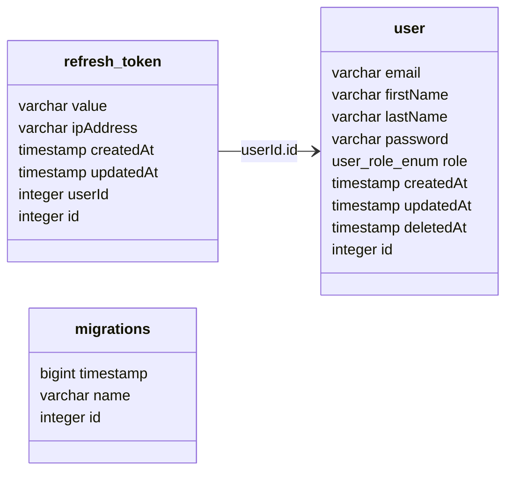

# Template NestJS API


Template project is deployed to the following environments:

- [template-nestjs-api.com/docs](https://template-nestjs-api.com/docs)
- [dev.template-nestjs-api.com/docs](https://dev.template-nestjs-api.com/docs)

**If you don't want to use GCP run following command:**

```bash
rm -rf infra .github/workflows/cd.yml .github/workflows/manual-cd.yml .github/workflows/manual-terraform.yml .github/workflows/terraform.yml
```

### Flavors:

- [Fastify](https://github.com/strvcom/backend-template-nestjs-api/tree/fastify) branch 🚀
- [Vertex AI](https://github.com/strvcom/backend-template-nestjs-api/tree/vertex-ai) branch 🤖
- [GCP Identity](https://github.com/strvcom/backend-template-nestjs-api/tree/gcp-identity) branch 🔐

## Table of Contents

- [Setup](#setup)
- [Development](#development)
- [Database](#database)
- [Testing](#testing)
- [Infra](#infra)

## Setup

1. Install dependencies: `make install` (the project uses [yarn](https://github.com/yarnpkg))
2. Create local environment file: `cp .env.template .env`
3. Run infrastructure `make infra` (`.db/init/init.sql` should automatically create `api_db` database)
4. Run database migrations: `make migration-run`

### Run with Docker

Note: if you want to run with docker, don't forget to change `DATABASE_HOST=0.0.0.0` to `DATABASE_HOST=database` in `.env` file.

Because of node bindings (`swc`, `bcrypt`) we can't share node_modules between host and docker container. To solve this issue we have to restart the container every time we install new package.

```bash
make develop-dockerized
```

## Development

- `make infra` - start postgres docker container
- `make develop` - start development server
- `make type-check` - run type checking
- `make lint` - run linter
- `make format` - run prettier

## Database

- `make seed-database` - truncate all tables and seed database with initial data
- `make migration-create name=<migration-name>` - create new empty migration file
- `make migration-generate name=<migration-name>` - generate migration file based on the current schema diff
- `make migration-run` - run all pending migrations
- `make migration-revert` - revert last migration
- `make schema-drop` - drop all tables



## Testing

Most of the tests are E2E tests, which means that they are testing the whole application, including the database. For
that.

- `make test` - run all tests

### Workflows

- `ci.yml` - lints and runs tests on every pull request.

## Infra

For more information about the infrastructure setup, please refer to the [infra](./infra/README.md) documentation.
