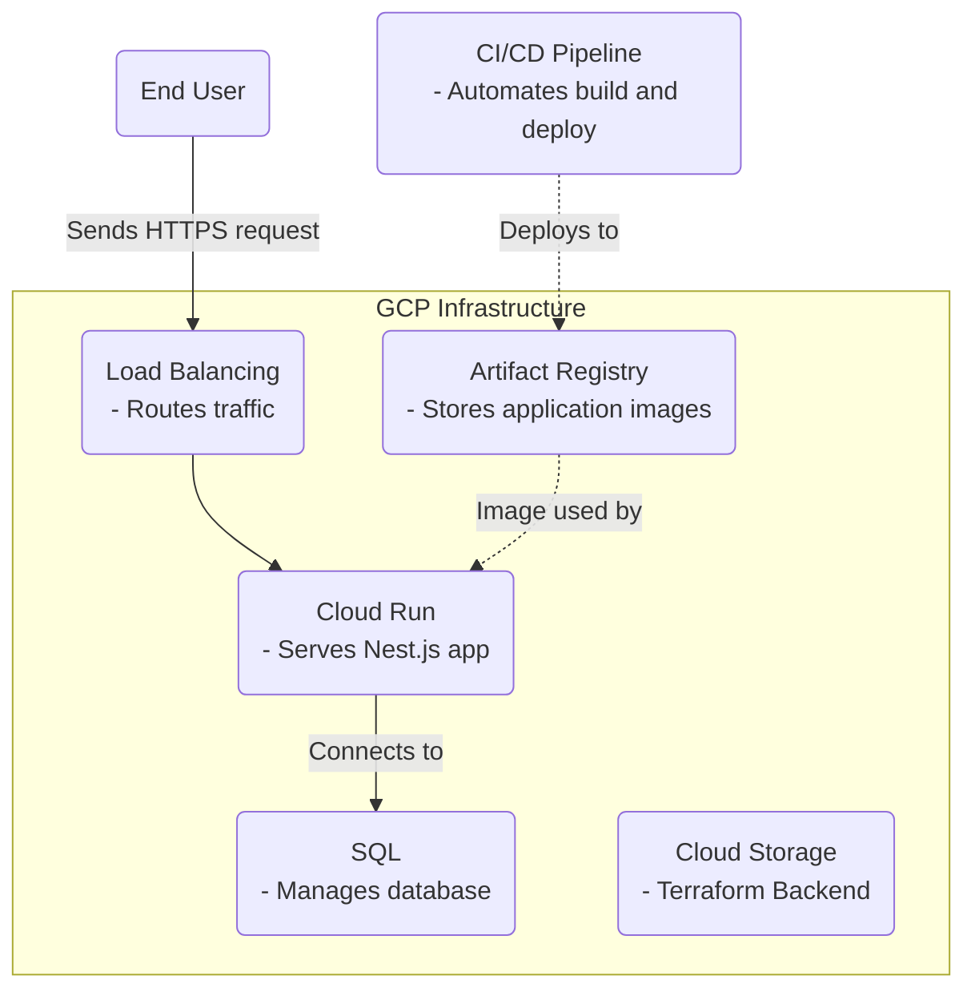

# Project Infrastructure Documentation

This doc outlines our infrastructure setup, Continuous Integration (CI) and Continuous Deployment (CD) workflows, and
provides instructions for common operations. Our infrastructure is codified using Terraform and managed on Google Cloud
Platform (GCP)

### Getting Started

For initial setup, please refer to the Jupyter Notebook located at [./SETUP.ipynb](./SETUP.ipynb) within the `/infra` directory. It
contains step-by-step instructions for setting up the infrastructure and deploying the project for the first time. You can find more information about [Jupyter notebook here](https://jupyter.org/install).

⚠️ If this is the first time here you can safely ignore the rest of the document and follow the instructions in the Jupyter Notebook.

## Infrastructure Overview

The services are hosted on Google Cloud Run, which allows for serverless execution of our containerized Nest.js
application. Secrets and credentials are managed
securely via Google Secret Manager, and the database needs are served by Google Cloud SQL.

A Google Cloud Storage (GCS) bucket is used for Terraform backend to maintain the state of our infrastructure securely.



## CI/CD Workflows

Development is supported by automated CI/CD pipelines to enforce code quality and streamline the deployment process:

- **CI Workflow (`ci.yml`)**: Linting and tests are run on every pull request to ensure code quality and functionality.
- **CD Workflow (`cd.yml`)**: Continuous deployment to staging occurs on every push to the `main` branch. This workflow
  ignores changes in `/infra` and `/.github`.
- **Terraform Workflow (`terraform.yml`)**: Executes `terraform plan` on pull requests and `terraform apply` on pushes
  to `main`, specifically when the `/infra` directory is modified.
- **Manual Deployment (`manual-cd.yml`)**: Allows for manual deployment to production, with the option to deploy to
  development if necessary.
- **Manual Terraform (`manual-terraform.yml`)**: Facilitates manual execution of `terraform apply` for the production
  environment and can be used for development as well.

## Development Process

### Authentication

Before interacting with GCP services, authenticate your machine with:

```sh
gcloud auth login
```

Set your active project with:

```sh
gcloud config set project <project-id>
```

#### Service Account

To create a key for the CI/CD service account, use the command bellow:

```sh
gcloud iam service-accounts keys create ~/<env>ci-cd-service-account-key.json --iam-account <env>-ci-cd-service-account@<project-id>.iam.gserviceaccount.com
```

### Docker Commands

Build and push your Docker image using:

```sh
docker build -t <region>-docker.pkg.dev/<project-id>/<repository-id>/<image-name>:latest .
docker push <region>-docker.pkg.dev/<project-id>/<repository-id>/<image-name>:latest
```

Authenticate Docker to GCP with:

```sh
gcloud auth configure-docker
```

Deploy the service using:

```sh
gcloud run deploy <service-name> --image <region>-docker.pkg.dev/<project-id>/<repository-id>/<image-name>:latest --platform managed --region=<region> --allow-unauthenticated
```

### Terraform Operations

Apply Terraform configurations for the development environment with:

```sh
terraform init
terraform workspace select <env>
terraform apply -var-file="environments/<env>/terraform.tfvars"
```
